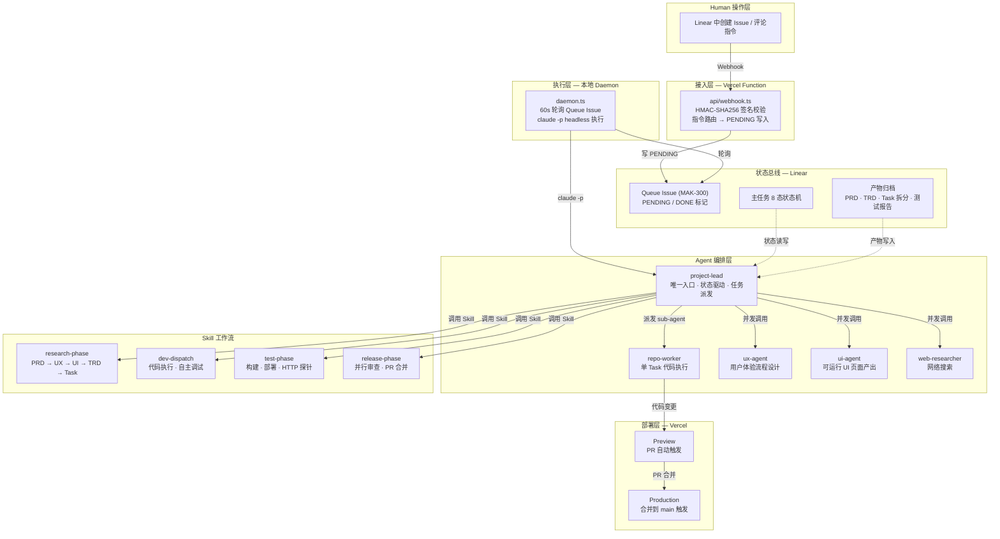
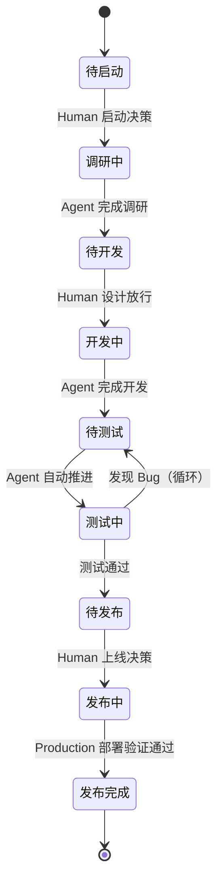

# mako-ai-claude-manager

基于 Claude Code 原生 Agent + Skill 能力的多项目并行全链路工作流系统。Linear 为状态总线，Vercel 为部署平台，支持最多 5 个项目同时推进。在任意 Git 仓库目录下启动即可接入工作流。

## 系统架构



## 端到端流程

```mermaid
flowchart LR
    subgraph Phase1["① 调研"]
        A1["Human 创建 Issue<br/>状态 → 调研中"]
        A2["PRD Agent 生成需求文档"]
        A3["UX Agent 输出交互流程"]
        A4["UI Agent 产出可运行页面<br/>Vercel Preview"]
        A5["TRD + Task 拆分"]
    end

    subgraph Phase2["② 开发"]
        B1["Human 审核放行<br/>状态 → 开发中"]
        B2["Git Worktree 隔离"]
        B3["repo-worker 并发执行<br/>按 step 依赖排序"]
        B4["统一 commit + push"]
        B5["自动创建 PR"]
    end

    subgraph Phase3["③ 测试"]
        C1["状态 → 测试中"]
        C2["构建验证"]
        C3["Vercel Preview 部署检查"]
        C4["HTTP 探针 + 验收标准对比"]
    end

    subgraph Phase4["④ 发布"]
        D1["Human 上线决策<br/>状态 → 发布中"]
        D2["并行审查<br/>架构 · 质量 · 完整性"]
        D3["PR 合并 → Production"]
        D4["Worktree 清理"]
    end

    A1 --> A2 --> A3 --> A4 --> A5
    A5 --> B1 --> B2 --> B3 --> B4 --> B5
    B5 --> C1 --> C2 --> C3 --> C4
    C4 --> D1 --> D2 --> D3 --> D4
```



## Agent 与 Skill 矩阵

### Agent（5 个）

| Agent | 职责 | 工具权限 | 约束 |
|-------|------|---------|------|
| **project-lead** | 唯一入口。读取 Linear 状态，派发任务，驱动工作流 | Read, Bash, Skill, Agent, Linear MCP | 不直接写代码，不改 PRD 主体 |
| **repo-worker** | 单个叶子 Task 代码执行 | Read, Edit, Write, Bash | 无 git 操作权限，不跨 Task |
| **ux-agent** | 从 PRD 产出用户体验流程、信息架构、交互规格 | Read, Linear MCP | 不改 PRD 主体目标 |
| **ui-agent** | 从 UX 方案产出可运行的 React/Tailwind/shadcn UI 页面 | Read, Edit, Write, Bash, Linear MCP | 不改 UX 流程结构 |
| **web-researcher** | 网络搜索与事实考据 | WebSearch, WebFetch | 不直接下结论替代主调用方判断 |

### Skill（7 个）

| Skill | 触发阶段 | 作用 |
|-------|---------|------|
| **research-phase** | 调研中 | 完整调研链路：PRD → UX → UI → TRD + Task 拆分，产物写入 Linear |
| **dev-dispatch** | 开发中 | 单 Task 代码执行，含诊断门控与自主调试循环（最多 3 轮重试） |
| **test-phase** | 测试中 | 构建验证、Vercel 部署检查、HTTP 探针、验收标准对比 |
| **release-phase** | 发布中 | 并行审查（架构/质量/完整性）、Human 授权检查、PR 合并、部署验证 |
| **report-phase** | 发布完成后 | 汇总各阶段产物，生成终报 |
| **review** | 按需 | 6 维度结构化代码审查（类型安全、运行时风险、代码质量、架构、性能、规范） |
| **linear-triage** | 按需 | 批量 Linear Issue 状态检索与汇总报告 |

## 状态机

### 主任务（8 态）



Human 强校验点（Agent 不可代行）：
- 待启动 → 调研中
- 待开发 → 开发中
- 待发布 → 发布中

### 子任务（3 态）

`Todo → In Progress → Done`

## 多项目并发

- 最多 5 个项目同时运行，每个项目独立 Daemon 进程
- 仓库路径、GitHub repo、Issue 前缀均从运行环境动态解析，无硬编码
- 每个 Issue 使用独立 Git Worktree（`${REPO_NAME}-${ISSUE_ID}`）+ Feature 分支，物理隔离
- 不同项目的 PR 独立创建与合并
- 同仓库多 Issue 合并时使用 merge lock 串行化，避免冲突

## 核心设计

**Webhook 纯中继 + 本地 Daemon 执行**。Vercel Function 只做验证和路由，不调用 Claude API：

- **api/webhook.ts**：自包含 Vercel Function。签名校验 → 指令路由 → 写 PENDING 标记
- **daemon.ts**：本地守护进程，轮询 Queue Issue（MAK-300），通过 `claude -p` 执行工作流
- **Linear MCP**：状态读写 + 产物归档
- 执行通过本地 Claude Code CLI 完成，不需要 Anthropic API key

### API 速率限制防护

- Webhook → Queue Issue 架构：Daemon 每次 poll 仅 2 次 API 调用
- 60s 轮询间隔：~120 次 API 调用/小时（Linear 限制为 2500/h）
- 自动检测 429 响应，等待限制重置后恢复

## 可视化 Dashboard

项目包含一个 Next.js Web 应用，用于可视化管理 `~/.claude/` 目录下的配置：

- **Agents 面板**：查看所有 Agent 定义、工具权限、职责描述
- **Skills 面板**：浏览 Skill 工作流定义与触发规则
- **Rules 面板**：查阅编码规范与项目约束
- **Settings 面板**：查看 Claude Code 全局配置（敏感值自动脱敏）
- **Directory Overview**：`~/.claude/` 目录结构树形展示

## 技术栈

| 层级 | 技术 |
|------|------|
| 运行时 | Bun |
| 框架 | Next.js 16（App Router） |
| UI | React 19 · Tailwind CSS 4 · shadcn/ui |
| 语言 | TypeScript |
| 数据库 | PostgreSQL（Drizzle ORM） |
| 认证 | Better Auth |
| 部署 | Vercel（Preview + Production） |
| 状态管理 | Linear MCP |
| Agent 执行 | Claude Code CLI（headless） |

## 快速开始

### 1. 环境变量

```bash
# .env（项目根目录）
LINEAR_WEBHOOK_SECRET=your_webhook_secret
LINEAR_API_KEY=your_linear_api_key
```

### 2. 启动 Daemon

```bash
bun install
bun run daemon        # 持续轮询模式
bun run daemon:once   # 单次执行后退出
```

### 3. 使用

在 Linear 中操作即可，Daemon 自动响应：

1. 创建 Issue（状态设为"调研中"）→ 自动执行调研链路（PRD → UX → UI → TRD → Task 拆分）
2. 审核调研产物后在 Linear 中放行 → 自动进入开发（Git Worktree 隔离 + 并发执行）
3. 开发完成 → 自动测试（构建验证 + Preview 部署 + HTTP 探针）
4. 测试通过后在 Linear 中批准发布 → 自动执行发布流程（并行审查 + PR 合并 + Production 部署）

### 4. 多项目接入

在任意 Git 仓库目录下启动 project-lead 即可接入，仓库信息自动从 git 环境解析：

```bash
# 项目 A
cd /path/to/project-a
claude --permission-mode bypassPermissions --agent project-lead "MAK-301"

# 项目 B（不同 Issue 前缀）
cd /path/to/project-b
claude --permission-mode bypassPermissions --agent project-lead "API-42"
```

## 项目结构

```
├── api/
│   └── webhook.ts                      # Vercel Function（自包含）
├── daemon.ts                           # 本地守护进程
├── src/                                # Dashboard Web 应用（Next.js 16）
│   ├── app/                            # App Router 页面
│   ├── components/                     # UI 组件
│   ├── lib/                            # 核心库（Claude 配置读取）
│   └── constants/                      # 常量定义
├── .claude/
│   ├── agents/                         # Agent 定义（5 个）
│   │   ├── project-lead.md             # 项目组长（唯一入口，动态解析仓库路径）
│   │   ├── repo-worker.md              # 代码执行
│   │   ├── ui-agent.md                 # UI 页面产出
│   │   ├── ux-agent.md                 # UX 流程设计
│   │   └── web-researcher.md           # 网络搜索
│   ├── skills/                         # Skill 工作流（7 个）
│   │   ├── research-phase/             # 调研阶段
│   │   ├── dev-dispatch/               # 开发派发
│   │   ├── test-phase/                 # 测试阶段
│   │   ├── release-phase/              # 发布阶段
│   │   ├── report-phase/               # 终报阶段
│   │   ├── review/                     # 代码审查
│   │   └── linear-triage/              # Issue 分诊
│   └── rules/                          # 编码规范（12 个文件）
├── vercel.json                         # Vercel 部署配置
├── COWORK_INSTRUCTIONS.md              # 系统级设计文档（v0.5）
├── CHANGELOG_FOR_HUMAN.MD              # 变更记录
└── package.json
```

## 文档

详细设计参见 [COWORK_INSTRUCTIONS.md](./COWORK_INSTRUCTIONS.md)（v0.5）。
